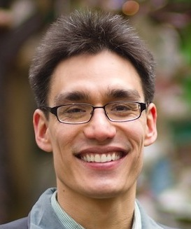

## Background

Achieving determinism on real software systems remains difficult. Even a batch-processing job, whose task is to map input bits to output bits, risks nondeterminism from thread scheduling, system calls, CPU instructions, and leakage of environmental information such as date or CPU model.

## Research Project

In 2015 we asked ourselves why there was no available, deployable way to run real Linux software deterministically. We thus set out to create user-space deterministic execution sandboxes.  This project follows from our [prior work](#related-and-prior-work) on deterministic parallel programming, which we conducted at the [language- and library-level](#deterministic-libraries-and-languages) as well as by modifying the [operating system and computer architecture](#deterministic-operating-systems-and-architectures).

### Detflow

Our first prototype, called DetFlow was described in a paper at
OOPSLA'17 [[1]](#references).  DetFlow uses a mix of language-support and
runtime sandboxing to achieve an end-to-end determinism guarantee.

 * DetFlow is [available on GitHub](https://github.com/iu-parfunc/detflow/).
 * The OOPSLA paper's artifact is available [from the ACM DL](https://dl.acm.org/citation.cfm?doid=3152284.3133897), under "Source Materials","Auxiliary Archive". It is a 5GB download.

In DetFlow, process-parallel programs are allowed if they are controlled by a *parallel coordinator* process written with special language support (a Haskell monad).  Subprocess are determinized using a runtime sandbox, but are sequentialized to keep overheads low.  DetFlow has well below 5\% overhead in all our experiments. However, this prototype uses LD_PRELOAD libc interception which is not sufficiently general or robust for a production quality implementation.

### DetTrace

Our second prototype of a runtime determinism sandbox is called, *DetTrace*.  DetTrace uses ptrace and is much more general than DetFlow, but is also higher-overhead.  In case studies, we have run the build and test code for 12,130 Debian packages inside DetTrace, and have run large applications like `blender` and `pdflatex` inside the deterministic sandbox as well.

A preprint for DetTrace will be posted here soon.

## Commercialization

The detbox approach is being commercialized by [Cloudseal Inc](https://cloudseal.io).  Cloudseal is building low-overhead record-and-replay-as-a-service (for bug and crash repro). The core of the approach is a deterministic execution capability that *minimizes* the amount of recording needed, and eliminates unnecessary nondeterminism, nondeterminism which creates headaches like flaky tests.

(In this third generation, production implementation of the approach, binary instrumentation is used to avoid ptrace and achieve both the low overhead of DetFlow and the generality of DetTrace.)

## Related and Prior Work

#### Binary Instrumentation

Believe it or not, in spite of decades of work on binary instrumentation and mechanisms for hooking functions or syscalls, we've had to develop new techniques for low-overhead interposition on Linux system calls and nondeterministic instructions.  Part of the reason for this is needing an all-userspace approach.

 * One chapter of our work on binary instrumentation was to develope rapidly-toggleable, low-overhead user-space probes, presented in our PLDI 2016 and 2017 publications [[2,3]](#references).

 * The **Reverie system** is an open-source instrumentation framework we are developing, [available on GitHub](https://github.com/iu-parfunc/reverie).

The basic idea of our approach is to avoid both the high startup overhead of full binary translation approaches (Pin, DynamoRIO) and avoid the high cost of trap instructions in breakpoint-based tracing frameorks (DTrace, SystemTap, etc).  This is done by patching guest process code in-place and injecting new code in the guest, but a fully general and performant solution requires solving a number of challenges (see the PLDI papers linked below).

#### Deterministic Libraries and Languages

The deterministic workflows project follows from several years of research on deterministic parallel programming, mainly using Haskell as a vehicle (though other projects target other languages, like [Deterministic Parallel Java](http://dpj.cs.illinois.edu/)). An example system our work in this area is the LVish system for programming with monotonic concurrent data structures [[4,5]](#references).

#### Deterministic Operating Systems and Architectures

In this work, we looked at enforcing determinism *without* requiring source-level changes to programs, instead allowing ourselves to freely change the operating system, compiler, and even computer architecture.  Representive papers include Eurosys'15, and ASPLOS'10,11 [[6,7,8]](#references). Research of this kind serves to show what is possible, while the emphasis of the deterministic workflows project is to emphasize deployable user-space solutions that achieve end-to-end determinism on existing computers and operating systems.

## People

 * [Baojun Wang](https://www.linkedin.com/in/wangbj)
 * [Kelly Renee Shiptoski](https://www.linkedin.com/in/kelly-shiptoski-a003585b/)
 * [Joseph Luke Devietti](https://www.cis.upenn.edu/~devietti/)
 * [Omar Salvador Navarro Leija](https://gatowololo.github.io/)
 * [Ryan Rhodes Newton](https://www.linkedin.com/in/rrnewton/)
 * [Ryan Scott](https://ryanglscott.github.io/about/)

   | :------: | :-------: |
    | 
   [Joseph Devietti](https://www.cis.upenn.edu/~devietti/) | [Ryan Newton](https://www.linkedin.com/in/rrnewton/)

 | :------: | :-------: |
 |  | [Joseph Luke Devietti](https://www.cis.upenn.edu/~devietti/) |
 |  | [Ryan Rhodes Newton](https://www.linkedin.com/in/rrnewton/) |

## References

 1. (**OOPSLA'17**) ["Monadic Composition for Deterministic, Parallel Batch Processing"](https://2017.splashcon.org/event/splash-2017-oopsla-detflow-a-monad-for-deterministic-parallel-shell-scripting), R Scott, O Navarro Leija, J Devietti, and R Newton, ACM SIGPLAN conference on Object-oriented Programming, Systems, Languages and Applications.

 2. (**PLDI'16**) ["Living on the edge: Rapid-toggling probes with cross modification on x86"](https://dl.acm.org/citation.cfm?id=3062344), B Chamith, B Svensson, L Dalessandro, R Newton. ACM SIGPLAN conference on Programming Language Design and Implementation.

 3. (**PLDI'17**) ["Instruction Punning: Lightweight Instrumentation for x86-64"](https://dl.acm.org/citation.cfm?id=2908084), B Chamith, B Svensson, L Dalessandro, R Newton. ACM SIGPLAN conference on Programming Language Design and Implementation.

 4. (**POPL'14**) ["Freeze After Writing: Quasi-Deterministic Parallel Programming with LVars and Handlers"](https://dl.acm.org/citation.cfm?doid=2535838.2535842), L Kuper, A Turon, N Krishnaswami, R Newton. ACM SIGPLAN Principals of Programming Languages.

 5. (**PLDI'14**) ["Taming the Parallel Effect Zoo: Extensible Deterministic Parallelism with LVish"](https://dl.acm.org/citation.cfm?id=2594312), L Kuper, A Todd, S Tobin-Hochstadt, R Newton. ACM SIGPLAN Programming Languages Design and Implementation.

 6. (**Eurosys'15**) ["High-Performance Determinism with Total Store Order Consistency"](http://dl.acm.org/authorize?N95410), T Merrifield, J Devietti and J Eriksson. European Conference on Computer Systems.

 7. (**ASPLOS'11**) ["RCDC: A Relaxed-Consistency Deterministic Computer"](http://dl.acm.org/authorize?473781), J Devietti, J Nelson, T Bergan, L Ceze and D Grossman. International Conference on Architectural Support for Programming Languages & Operating Systems.

 8. (**ASPLOS'10**) ["CoreDet: A Compiler and Runtime System for Deterministic Multithreaded Execution"](http://dl.acm.org/authorize?218419). T Bergan, O Anderson, J Devietti, L Ceze and D Grossman. International Conference on Architectural Support for Programming Languages & Operating Systems.

